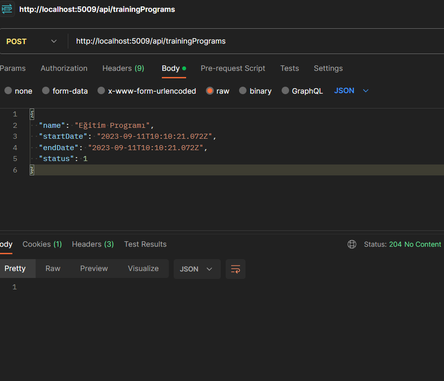
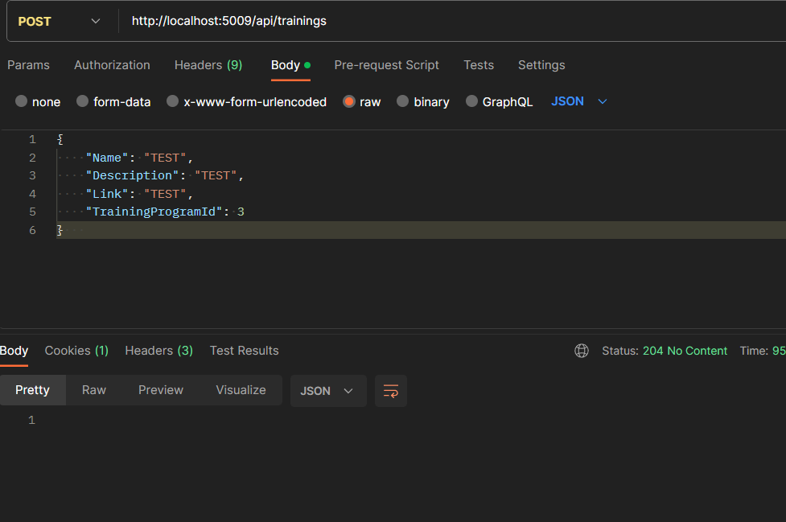

<!DOCTYPE html>
<html>

<head>
  <meta charset="utf-8">
  <meta name="viewport" content="width=device-width, initial-scale=1.0">
  <link rel="stylesheet" href="https://stackedit.io/style.css" />
</head>

<body class="stackedit">
  
<h1 id="todo-application">Education Api</h1>

Application that I developed with NET 7.0

<h1 id="getting-started">Getting Started</h1>

Make sure you have install and configured docker in your environment. After that, you can run the below commands from the / directory and get started with the Education-Api immediately.

<pre><code>docker-compose up -d
</code></pre>

For apigateway you should run the following command line

<pre><code>http://localhost:5009/
</code></pre>
<h1 id="used-technologies">Used Technologies</h1>

.Net 7 
Ocelot 
Docker 
xUnit 
Redis 
PostgreSQL 
Entity Framework Core 
N-Tier Architecture 
Repository Pattern 

<h1 id="used-technologies">Postman Tests</h1>

<h1 id="used-technologies">Unit Tests</h1>

</body>

</html>
